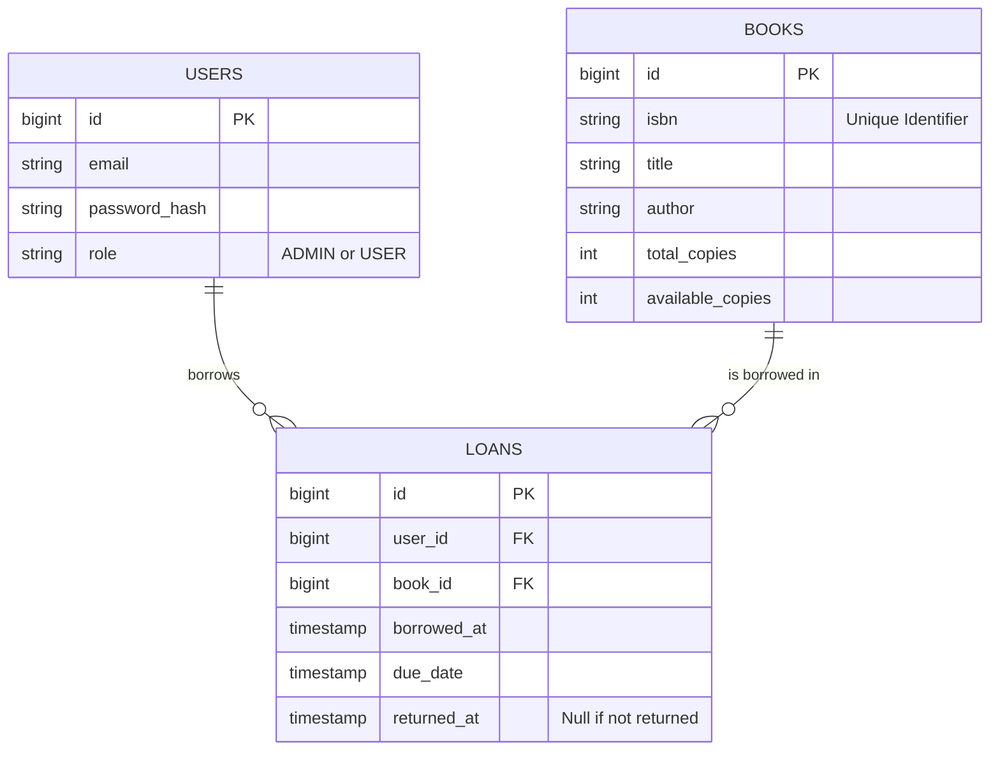

# Library System Project - Phase 1 Summary

## 1. Executive Summary
**Goal**: To build a modern Library Management System using Spring Boot, PostgreSQL, and Microservices principles.
**Current Status**: Phase 1 (Initialization) is **Complete**.
**Architecture**: We chose a **Maven Multi-Module** approach to allow for easy transition to microservices while starting simple.

---

## 2. What We Built (And Why)

### A. The Project Structure (Multi-Module)
We created a "Parent" project that manages two "Child" modules.
*   **Why?**: In the future, you might have `User Service`, `Notification Service`, etc. Managing dependencies (like Spring Boot versions) in 10 different files is a headache. With this structure, you update the **Parent**, and everyone updates.

### B. The Infrastructure (Docker)
We created a `docker-compose.yml` file.
*   **Why?**: Installing PostgreSQL manually on a Mac can be messy. Docker lets us spin up a disposable database in seconds. If it breaks, we just delete the container and start fresh.

### C. Database Version Control (Flyway)
We added **Flyway** and a SQL script `V1__init_schema.sql`.
*   **Why?**: In the old days, we might run SQL scripts manually. If you forgot to run script #5, the app crashes. Flyway runs these scripts automatically on startup, ensuring the DB is always in sync with the code.

---

## 3. File & Class Roles ("The Jobs")

Here is a breakdown of the key files we created and their specific "jobs":

### 🏗️ Configuration Files
1.  **`pom.xml` (The Parent)**
    *   **Job**: The Project Manager. It dictates which Java version to use (17) and which Spring Boot version to use (3.2.1). It does *not* contain code.
2.  **`docker-compose.yml`**
    *   **Job**: The Infrastructure Manager. It tells Docker: "Please download PostgreSQL version 15 and run it on port 5432 with password 'password'."

### 📦 Modules
3.  **`library-common`** (Module)
    *   **Job**: The Utility Belt. It will hold code that *every* service needs (e.g., standard Error Messages). currently empty but ready.
4.  **`book-service`** (Module)
    *   **Job**: The Core Application. This is where the business logic lives.

### 💻 Code & Resources (Inside `book-service`)
5.  **`BookServiceApplication.java`** (`@SpringBootApplication`)
    *   **Job**: The Ignition Key. This is the standard Spring Boot entry point. When you run this `main` method, it starts the embedded web server (Tomcat).
6.  **`application.yml`**
    *   **Job**: The Settings File. It contains the database URL, username, and password. It tells the app *where* to find the database.
7.  **`V1__init_schema.sql`**
    *   **Job**: The Blueprint. It is a raw SQL script that creates your tables (`CREATE TABLE books...`). Flyway reads this file and executes it.

---

## 4. Plan for Next Session (Phase 2)

When you return, we will focus on **Java Coding** and **Business Logic**.

**Next Steps**:
1.  **Create the Entity (`Book.java`)**: We will map the database table to a Java class using JPA/Hibernate.
2.  **Create the Repository (`BookRepository.java`)**: We will create an interface that allows us to find, save, and delete books without writing raw SQL.
3.  **Create the Service**: We will write the methods that handle the logic (e.g., "Check if book ISBN is valid before saving").

---

## 5. Complete Project Roadmap

Here is the full plan we designed, tracking our progress from Phase 1 to Deployment.

- [x] **Phase 1: Project Initialization & Environment Setup**
    - [x] Define Maven Multi-Module Structure (Parent, Common, Services)
    - [x] Create `docker-compose.yml` for PostgreSQL
    - [x] Configure Flyway for Database Migrations
    - [x] Verify Application Context & DB Connection
    - [x] **Setup Version Control (Git & GitHub)**
- [ ] **Phase 2: Domain Modeling & Data Access**
    - [ ] Create `common` module for shared DTOs/Utils
    - [ ] Implement JPA Entities (starting with Books/Authors)
    - [ ] Create Flyway Migration Scripts (SQL)
    - [ ] Implement Repositories & Service Logic
- [ ] **Phase 3: REST API Development**
    - [ ] Create REST Controllers
    - [ ] Global Exception Handling
    - [ ] OpenAPI/Swagger Documentation
- [ ] **Phase 4: Security Implementation**
    - [ ] Add Spring Security & JWT
- [ ] **Phase 5: Refactoring to Microservices**
    - [ ] Extract Identity Service or Notification Service
    - [ ] Service Discovery & Gateway
- [ ] **Phase 6: Deployment**
    - [ ] Containerize Services (Dockerfiles)
    - [ ] Kubernetes Deployment

---

## 6. Proposed Database Schema

To visualize the future, here is the relational design we are aiming for:

---

## 7. Version Control Cheat Sheet

You successfully initialized Git and pushed to GitHub. Here is what the commands mean for your future reference:

| Command | Meaning |
| :--- | :--- |
| **`git init`** | **Initialize**. Turns the current folder into a new Git repository (creates a hidden `.git` folder). |
| **`git add .`** | **Stage All**. Tells Git to "watch" every file in the folder for the next save. The `.` means "current directory". |
| **`git commit -m "msg"`** | **Save**. Takes a snapshot of the staged files. Always requires a message (`-m`) to explain *what* you changed. |
| **`git branch -M main`** | **Rename Branch**. Modern Git uses `main` as the default branch name instead of `master`. This command renames it. |
| **`git remote add origin`** | **Link to Cloud**. Connects your local folder to a specific URL on GitHub. `origin` is just the nickname for that URL. |
| **`git push -u origin main`** | **Upload**. Sends your local commits to the server (`origin`). The `-u` flag saves this link so next time you can just type `git push`. |
